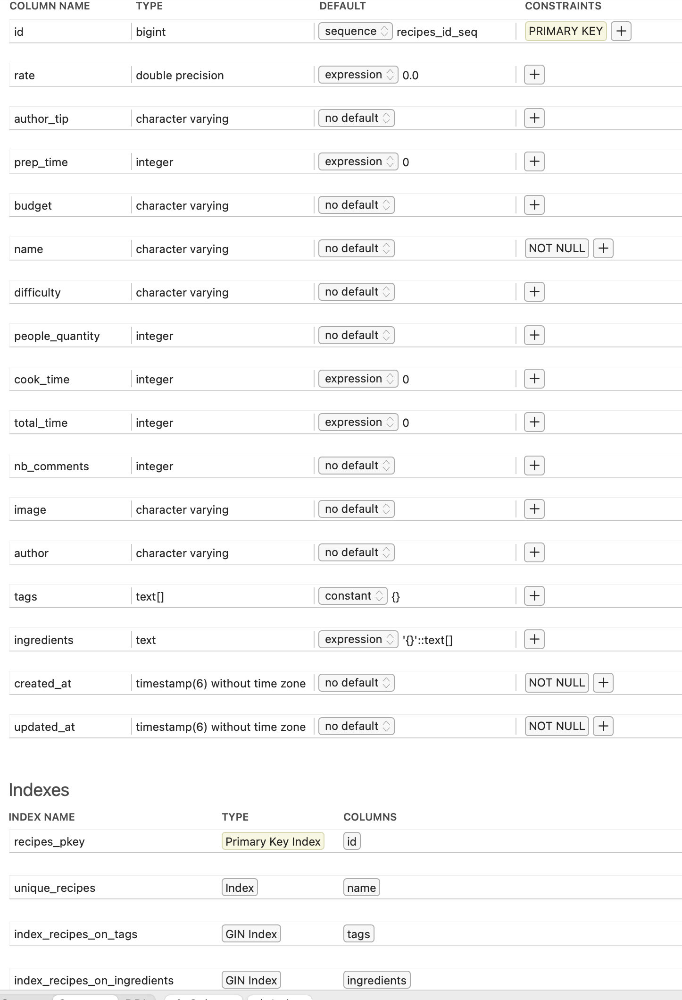

# README

# Instalation and Usage
 Please check out the app on Heroku: https://young-taiga-69931.herokuapp.com/
 Alternatively if you want to test locally 
- setup a ruby/rails environment: ruby-3.0.0 and rails 6.1.4
- git clone git@github.com:astoica1986/masterchef.git
- make sure all dependencies for the 'pg' gem are installed
- bundle install
- rake db:migrate
- rake utils:import_recipes path='db/seeds/recipes.json'

# Development Notes&Thoughts for Pennylane review team
- I have initially intended to normalize the database by having at least 4 main tables:
Authors, Recipes, Tags, Ingredients + connecting tables. However after thinking about it, I decided it's not necessary at his moment.  
First of all having it all in one table makes importing the recipes json very fast even with many more 1000's of records.  
Also using text columns with gin index and Postgres' array column(for tags) seems to work fine until we will need to really scale up.
And finally the ingredients data seems totally random, not sure a new table makes sense.
- ~~If we do need to scale up, we could go with improving the postgres full text indexing, normalizing the database while also moving th import operation
to a job~~ (done)
  

# Current issues
- ~~I have ran out of time so there's a big whole in the test coverage (the search service which is the main part of this app and also the importer service)~~ fixed
- I haven't added any React components, it's all server side rendered html and erb
- The UI looks terrible but the test requirements mentioned that I shouldn't worry about that

Thank you for your consideration and some delicious recipe ideas!

# Update
After talking to the reviewing team I have received the following enhacement requests:  
_Your code should be able to filter with several ingredients  
Filtering with more ingredients should give more results  
You should also have a good sorting strategy_

### Based on these requests I have made the following changes:
- I have added full text search to the project using pg_search and a postgres stored column with gin index
- Ingredients, name, author and difficulty are all now searched using a single "content" field (the columns are not equal in importance ; ingredients matches give the highest rank, name second etc..)
- As a result if the content filter has no value, no records as a return ; as we add more and more words to the content filter, more results are returned (each word is matched separately)
- All the other filters will reduce the number of returned records(rate, prep_time etc.)
- Sorting is now condensed to just a few options, the most important being Relevance(search result rank). As before, the sort order can be both ascending and descending
- I've added tests for the search ands import services
